<!-- markdownlint-disable -->

<!-- ╔══════════════════════════════════════════════╗ -->
<!--   HEADER                                         -->
<!-- ╚══════════════════════════════════════════════╝ -->
<div align="center">

</div>

<br/>

<!-- ┌─────────────────────────────────────────────────────────┐ -->
<!--   TYPING ANIMATION + BADGES                                 -->
<!-- └─────────────────────────────────────────────────────────┘ -->
<div align="center">

<a href="https://github.com/VARDHAMANPATEL23">
  
</a>

<br/>

[](https://github.com/VARDHAMANPATEL23)
&nbsp;
[](https://github.com/VARDHAMANPATEL23)

</div>

<br/>

---

### ◈ &nbsp;SYSTEM IDENTITY

```python
vardhaman = {
    "location"   : "India 🇮🇳",
    "timezone"   : "UTC +05:30",
    "interests"  : ["IoT", "Computer Vision", "Linux Systems", "AI/ML", "Automation"],
    "current"    : "Building things that blur the line between software and hardware",
    "philosophy" : "If it runs on Linux, I'll hack it."
}
```

<br/>

---

### ◈ &nbsp;ACTIVE PROJECTS &nbsp;`[4 DEPLOYED]`

<br/>

**PROJECT 01 — SMART MIRROR · IoT Information Hub**

> *An IoT-based Smart Mirror that blends a traditional mirror with a digital display to show real-time updates like time, weather, and news — your morning briefing, built into your wall.*

  

[](https://github.com/VARDHAMANPATEL23/Smart-Mirror)

<br/>

**PROJECT 02 — LINUX FACEID · Biometric Auth via PAM**

> *A Linux PAM module that brings Face ID to your terminal. Enables facial authentication for `sudo` and GDM lockscreen using blink-based liveness detection to prevent spoofing.*

   

[](https://github.com/VARDHAMANPATEL23/Linux-FaceId)

<br/>

**PROJECT 03 — LINUX AUTO UPDATER · One Script to Rule All**

> *A unified updater for Linux developers. Auto-detects your package manager (apt, dnf, pacman, etc.), Snap, Flatpak, and dev environments (NVM, npm, yarn, bun) — and updates everything in one shot.*

 

[](https://github.com/VARDHAMANPATEL23/Linux-Auto-Updater-Script)

<br/>

**PROJECT 04 — DOTIFY CLIENT · Texture Image Converter**

> *A fork & contribution of an online image converter that transforms photos into stunning dot/texture-style art. No data saved, fully free, runs in the browser.*

 

[](https://github.com/VARDHAMANPATEL23/dotify-client)

<br/>

---

### ◈ &nbsp;TECH STACK

<br/>

<div align="center">
  <table align="center">
    <tr>
      <td align="center" width="50%">
        <b>Languages & Scripting</b><br><br>
        
        <br>
        
        
      </td>
      <td align="center" width="50%">
        <b>AI / Computer Vision</b><br><br>
        
        <br>
        
      </td>
    </tr>
    <tr>
      <td align="center" width="50%">
        <b>Linux & DevOps</b><br><br>
        
        <br>
        
        
      </td>
      <td align="center" width="50%">
        <b>IoT & Hardware</b><br><br>
        
        
      </td>
    </tr>
    <tr>
      <td align="center" colspan="2">
        <b>Web & Frameworks</b><br><br>
        
        
      </td>
    </tr>
  </table>
</div>

<br/>

---

### ◈ &nbsp;GITHUB STATS

<div align="center">


&nbsp;&nbsp;


<br/>


</div>

<br/>

---

### ◈ &nbsp;CONTRIBUTION GRAPH — GIT INVADERS

<div align="center">
  
</div>

<br/>

---

### ◈ &nbsp;CONNECT

<div align="center">

[](https://linkedin.com/in/vardhman-patel)
[](https://github.com/VARDHAMANPATEL23)

</div>

<br/>

<!-- ╔══════════════════════════════════════════════╗ -->
<!--   FOOTER                                         -->
<!-- ╚══════════════════════════════════════════════╝ -->
<div align="center">

</div>